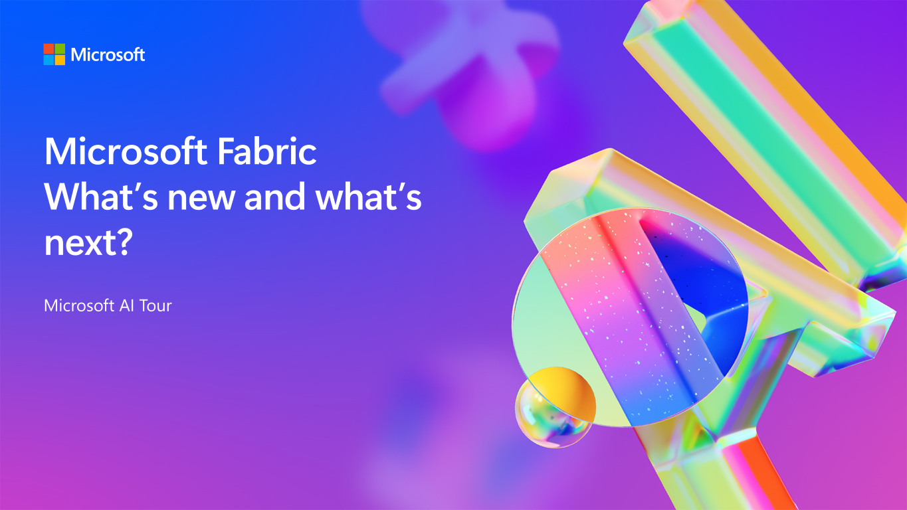

# Microsoft Fabric: What's new and what's next? - Session resources

> Learn more about Microsoft AI Tour on the official website.

## Slides & resources

| Resources          | Links                             | Description        |
|:-------------------|:----------------------------------|:-------------------|
| Session slides     | [View    ](https://aka.ms/AArpon1) | Review the slides at your own pace |
| Fabric Updates blog     | [Fabric Updates blog](https://blog.fabric.microsoft.com/) | Read about the latest product updates |
| Fabric Roadmap    | [Fabric Roadmap](https://aka.ms/FabricRoadmap) | Be in the know with the latest developments and upcoming features. |
| Microsoft Copilot for Data Analysts or Data Engineers  | [Learn](https://aka.ms/aitour-data-clh) | Learn more Coplot for Data professionals with this collection of resources on Microsoft Learn |

## Dive Deeper into Microsoft Fabric

### 👩‍💻 Microsoft Fabric Career Hub

The one-stop location to begin your learning journey for the [DP-600: Implementing Analytics Solutions Using Microsoft Fabric certification](https://learn.microsoft.com/en-us/credentials/certifications/exams/dp-600/).

[Microsoft Fabric Career Hub on the Fabric Community Site](https://aka.ms/FabricCareerHub?ocid=fabric24_careerhub_blog_cxa)

### 📖 Hands-On Learning with Fabric

Enhance your skills with over 30 interactive, on-demand learning modules tailored for Microsoft Fabric.

[Start Your Learning Journey](https://learn.microsoft.com/training/browse/?products=fabric)

### 🟩 Easy Learning with [Fabric Notes](https://aka.ms/fabricnotes)

Unlock the power of Microsoft Fabric with engaging, easy-to-understand illustrations. Perfect for all levels of expertise!

[Access Fabric Notes Here](https://aka.ms/fabricnotes)

## 🗺️ Your Path to Microsoft Fabric Certification

Get ready for [DP-600: Implementing Analytics Solutions Using Microsoft Fabric](https://learn.microsoft.com/credentials/certifications/exams/dp-600/). Start preparing today to become a certified Microsoft Fabric practitioner.

## 💬 Join the Microsoft Fabric Community

Connect with fellow Fabric enthusiasts and experts. Your one-stop community hub: https://community.fabric.microsoft.com/. Here's what you'll find:

- Interactive forums, like the [Synapse Forum](https://community.fabric.microsoft.com/t5/Synapse-forums/ct-p/AC-Community).
- A global directory of [Fabric User Groups](https://community.fabric.microsoft.com/t5/Fabric-User-Groups/ct-p/fbc_usergroups).
- The [Ideas Platform](https://ideas.fabric.microsoft.com/) for sharing and voting on product feedback.
- Stay updated with the [Official Updates Blog](https://blog.fabric.microsoft.com/blog/).
